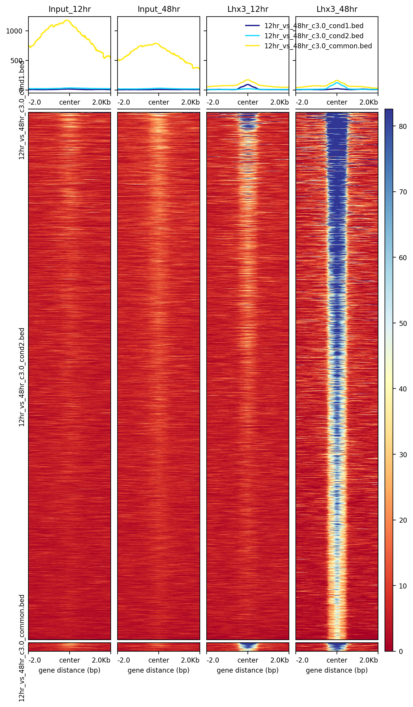

```{r setup, include=FALSE}
knitr::opts_chunk$set(echo = TRUE)
```

## Introduction

In this assignment, you will be analyzing ChIP-Seq & RNA-Seq data to investigate gene regulation in the development of spinal motor neurons in mice. The data is retrieved from [a study from the Mazzoni lab](https://pubmed.ncbi.nlm.nih.gov/27939218/) and is trimmed, aligned/quantified, deduplicated (for ChIP-Seqs), and indexed for you. For the pre-processing scripts, please refer to pre-process.html if you are interested.

You can find the files you need in `/scratch/work/courses/AppliedGenomics2021Sec3/assignment05`. In this folder, you will find:

- `align/`: Containing indexed BAM files for input and Lhx3 ChIP-Seq at 12 and 48 hours.
- `HOCOMOCOv11_core_MOUSE_mono_meme_format.meme`: MEME-compatible motif database from [HOCOMOCO](https://hocomoco11.autosome.ru) (for MEME-ChIP)
- `Mus_musculus.GRCm38.dna.toplevel.fa`: A soft link to GRCm38 reference genomic FASTA (used in `bedtools getfasta`)
- `metadata.tsv`: A tab-separated file containing the information of the samples.


## Analysis

### Quality control

Please prepare two fingerprint plots for the ChIP-Seq data from 12 hr and 48 hr respectively. You can use `plotFingerprint` from `deeptools`to do this. The fragment size of the data is 500 bp.

- Upload the two plots & the sbatch script (suggested: It could take a while to run) (10%)

```
#! /bin/bash

#SBATCH --nodes=1
#SBATCH --ntasks-per-node=1
#SBATCH --cpus-per-task=6
#SBATCH --mem=16G
#SBATCH --time=1:00:00
#SBATCH --job-name=hw5_plotMapping
#SBATCH --mail-type=ALL
#SBATCH --mail-user=td2201@nyu.edu


module purge
module load deeptools/3.5.0

cd /scratch/td2201/appl_genomics/week_10_CHiPseq/assignment05/

plotFingerprint -p 6 -b align/SRR3390053_dedup.bam align/SRR3390056_dedup.bam \
        --labels Input_12hr Lhx3_12hr --minMappingQuality 30 \
        --skipZeros --ignoreDuplicates \
        --extendReads 500 \
        -o ctrl_Lhx3_12hr.pdf

plotFingerprint -p 6 -b align/SRR3390069_dedup.bam align/SRR3390073_dedup.bam \
        --labels Input_48hr Lhx3_48hr --minMappingQuality 30 \
        --skipZeros --ignoreDuplicates \
        --extendReads 500 \
        -o ctrl_Lhx3_48hr.pdf
```


- Describe what you see in the plots. Do you see something unexpected? (10%)

During the 12hr plot, you can see that the input and Lhx3 are almost at the same line which means there is no adequate enrichment from the binding happened and lacking quality sequences from this CHIP-Seq. Whereas if you see the plot at 48hrs, the input shows a slight dip as well we saw for 12hrs input which is due to the fact that certain parts of the genome were sequenced more often. Now if you see the line for Lhx3 at 48hrs, there is a nice gap from the input meaning there was a good amount of enrichment from the binding and some quality sequences are present from the CHIP-seq, also note that at the start almost 20% of the genome has no reads, as its in bottom as a straight line.


## Differential peak calling visualization

### Differentially-bound region between stages (20%)

Besides Limma, which provides `csaw` that allows us to find differential binding when sufficient number of replicates are provided, many peak callers also offer differential binding analysis, and `MACS2` is among them.

The description of `MACS2`'s approach can be found [here](https://github.com/macs3-project/MACS/wiki/Call-differential-binding-events). Please use this function to identify peaks that are differentially bound by Lhx3 at 12 and 48 hr.

You need to upload or attach in this rmarkdown file the script you use to run this analysis.

```
module purge
module load macs2/intel/2.2.7.1

macs2 callpeak -B -t align/SRR3390056_dedup.bam \
        -c align/SRR3390053_dedup.bam \
        --nomodel \
        --extsize 200 \
        --outdir=macs2_12hr \
        --name 12hrs

macs2 callpeak -B -t align/SRR3390073_dedup.bam \
        -c align/SRR3390069_dedup.bam \
        --nomodel \
        --extsize 200 \
        --outdir=macs2_48hr \
        --name 48hrs

egrep "tags after filtering in treatment|tags after filtering in control" 12hrs_peaks.xls 

egrep "tags after filtering in treatment|tags after filtering in control" 48hrs_peaks.xls 


module purge
module load macs2/intel/2.2.7.1

macs2 bdgdiff --t1 macs2_12hr/12hrs_treat_pileup.bdg \
              --c1 macs2_12hr/12hrs_control_lambda.bdg \
              --t2 macs2_48hr/48hrs_treat_pileup.bdg \
              --c2 macs2_48hr/48hrs_control_lambda.bdg \
              --d1 15203050 \
              --d2 6921034 \
              --o-prefix 12hr_vs_48hr

```

***

### Visualizing coverage and peaks (20%)

It is often feasible to check the ChIP-seq signal around some genes that we know a priori that the ChIPed protein is bound to as a sanity check, and this can be done by loading a bigWig file and the peak files to IGV.

bigWig is a light-weight version file containing coverage information and can be generated from aligned BAM files with `bamCoverage` provided by `deeptools.`

Please set `--scaleFactor=1, --extendReads 500,` and `--normalizeUsing RPKM`.

```
module purge
module load deeptools/3.5.0

bamCoverage --bam align/SRR3390053_dedup.bam \
            -o bam_coverage/Input_12hr.bw \
            --scaleFactor=1 \
            --normalizeUsing RPKM \
            --ignoreForNormalization chrX \
            --outFileFormat bigwig \
            -p max \
            --extendReads 500


bamCoverage --bam align/SRR3390056_dedup.bam \
            -o bam_coverage/Lhx3_12hr.bw \
            --scaleFactor=1 \
            --normalizeUsing RPKM \
            --ignoreForNormalization chrX \
            --outFileFormat bigwig \
            -p max \
            --extendReads 500


bamCoverage --bam align/SRR3390069_dedup.bam \
            -o bam_coverage/Input_48hr.bw \
            --scaleFactor=1 \
            --normalizeUsing RPKM \
            --ignoreForNormalization chrX \
            --outFileFormat bigwig \
            -p max \
            --extendReads 500


bamCoverage --bam align/SRR3390073_dedup.bam \
            -o bam_coverage/Lhx3_48hr.bw \
            --scaleFactor=1 \
            --normalizeUsing RPKM \
            --ignoreForNormalization chrX \
            --outFileFormat bigwig \
            -p max \
            --extendReads 500
```


Load all 4 bigWig tracks (input and Lhx3 ChIP-Seq at two time points) to IGV using mm10 annotation, and navigate to Slit2.

**Save the screenshot (File > Save Image) and describe how the binding of Lhx3 changes between 12 - 48 hours of the reprogramming process.**

You might want to select all the track (hold shift) and right click to select "Group autoscale" to make sure the scale of every track dynamically changes according to the region you are examining but remain the same for every track.


Visualizing the bigwig files at different timeframe and comparing them with peak files generated by Macs2, I see only one good peak at 12hrs for Lxh3 meaning there is little amount of binding of Lhx3 whereas there are some more peaks in 48hrs track and the peak that was seen at 12hrs is much higher at 48hrs, which gives a good idea that at 48hrs there is higher rate of binding of Lhx3 meaning good amount of enrichment happened at 48hrs.

***

### Visualize ChIP-seq signal around Lhx3 peaks (20%)

In the previous section, you should obtain 3 BED files containing peaks that are preferentially bound at 12 hr, at 48 hr, and are commonly bound at both stages. To understand the cooperation and interaction between transcription factors and chromatin landscape, we are going to use a profile heatmap to show the signal intensity of Lhx3, Isl1, and H3K27ac ChIP-Seq at 12 and 48 hr around Lhx3 peaks that are differentially bound between stages.

`deeptools` provides a convenient command, `computeMatrix`, which allows you to provide multiple BED files that contains the region of interest, and to calculate intesity score around these regions with scaling (`scale-regions` mode, for making metagene plots) or without scaling (`reference-point` mode, for making (mean) profile plots).

We will be using `reference-point` mode and examine 2kb up/downstream of the `center` of our differentially bound peaks. The intensity of ChIP-Seq for Lhx3, Isl1, and H3K27ac will be calculated from the bigWig files we generated for visualization.

`computeMatrix` will generate a zipped matrix file which can be later used by `plotHeatmap` to make a faceted heatmap with profile plots.

Please upload a PNG file that contains the intensity heatmap and profile plot of the six tracks of ChIP-Seq for the Lhx3 differential bound peaks. You can also insert the plot here in the Rmarkdown file.


```
module purge
module load deeptools/3.5.0

computeMatrix reference-point \
       --referencePoint center \
       -b 2000 \
       -a 2000 \
       -R 12hr_vs_48hr_c3.0_cond1.bed 12hr_vs_48hr_c3.0_cond2.bed 12hr_vs_48hr_c3.0_common.bed \
       -S bam_coverage/Input_12hr.bw bam_coverage/Input_48hr.bw bam_coverage/Lhx3_12hr.bw \
       bam_coverage/Lhx3_48hr.bw \
       -o compute_matrix/12hr_vs_48hr_matrix.gz \
       -p 6 \
       --samplesLabel Input_12hr Input_48hr Lhx3_12hr Lhx3_48hr \
       --outFileSortedRegions compute_matrix/sorted_regions.bed

plotHeatmap -m compute_matrix/12hr_vs_48hr_matrix.gz \
            -out compute_matrix/12hr_vs_48hr_Heatmap.png

```


***

### Motif discovery for Lhx3 binding sites (20%)

Finally, please use [MEME-ChIP](https://meme-suite.org/meme/doc/meme-chip.html?man_type=web) or [HOMER](http://homer.ucsd.edu/homer/) to perform motif enrichment analysis.
If you were to use MEME-ChIP, you'll want to utilize `bedtools getfasta` to retrieve the actual sequence corresponding to the peak coordinates.

You need to attach the script you used to perform motif discovery here or submit it as an individual file to NYU Classes. The report for both MEME-ChIP and HOMER is a folder. Please compress the folder as a tar.gz file and submit it to NYU Classes.

```
module purge
module load meme/openmpi/intel/5.3.0
module load bedtools/intel/2.29.2

bedtools getfasta -fi Mus_musculus.GRCm38.dna.toplevel.fa \
                -bed 12hr_vs_48hr_c3.0_cond1.bed \
                -fo macs2_cond1.fa.out
                
bedtools getfasta -fi Mus_musculus.GRCm38.dna.toplevel.fa \
                -bed 12hr_vs_48hr_c3.0_cond2.bed \
                -fo macs2_cond2.fa.out
                
bedtools getfasta -fi Mus_musculus.GRCm38.dna.toplevel.fa \
                -bed 12hr_vs_48hr_c3.0_common.bed \
                -fo macs2_common.fa.out
                

meme-chip -o meme_chip1/ \
          -db HOCOMOCOv11_core_MOUSE_mono_meme_format.meme \
          macs2_cond1.fa.out
          
meme-chip -o meme_chip2/ \
          -db HOCOMOCOv11_core_MOUSE_mono_meme_format.meme \
          macs2_cond2.fa.out
          
meme-chip -o meme_chip3/ \
          -db HOCOMOCOv11_core_MOUSE_mono_meme_format.meme \
          macs2_common.fa.out
          
```

To gzip the whole folder for meme output I used the following commands:

```
tar -zcvf meme_chip.tar.gz meme/

```


***